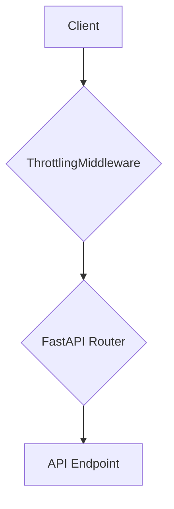

# Component Architecture

### New Components

**Component: `ThrottlingMiddleware`**

*   **Responsibility:** To intercept incoming requests, check them against the defined rate limits, and queue them if necessary to prevent exceeding the m.Stock API's limits.
*   **Integration Points:** This component will be implemented as a FastAPI middleware, making it a central entry point for all API requests.
*   **Dependencies:** It will depend on the `fastapi` and `slowapi` libraries.
*   **Technology Stack:** Python

### Component Interaction Diagram

