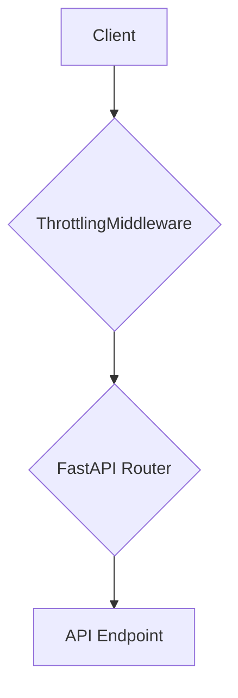

# m.Stock Interface Brownfield Enhancement Architecture

## Introduction

This document outlines the architectural approach for enhancing the **m.Stock Interface**. The enhancement focuses on refactoring the project to act as a secure and robust bridge to the m.Stock servers. This involves implementing features to handle complexities such as login, rate-limiting, and other security enhancements, starting with rate-limiting logic. Its primary goal is to serve as the guiding architectural blueprint for AI-driven development of new features while ensuring seamless integration with the existing system.

**Relationship to Existing Architecture:**
This document supplements the existing project architecture by defining how new components will integrate with current systems. Where conflicts arise between new and existing patterns, this document provides guidance on maintaining consistency while implementing enhancements.

### Change Log

| Change | Date | Version | Description | Author |
| :--- | :--- | :--- | :--- | :--- |
| Initial Draft | 2025-09-02 | 1.0 | First draft of the architecture | Winston (Architect) |

## Existing Project Analysis

*   **Primary Purpose:** To act as a bridge to connect to m.Stock servers to place and track trades, handling complexities like login and security.
*   **Current Tech Stack:** A FastAPI/Uvicorn Python application using the `mStock-TradingApi-A` SDK.
*   **Architecture Style:** A single-file application (`interface.py`) with no automated tests.
*   **Deployment Method:** Manual execution of the Uvicorn server.

## Enhancement Scope and Integration Strategy

#### Enhancement Overview

*   **Enhancement Type:** Performance/Scalability Improvements, Security Improvements
*   **Scope:** Refactor the project to be a secure and robust bridge to the m.Stock servers, starting with rate-limiting logic.
*   **Integration Impact:** Moderate Impact

#### Integration Approach

*   **Code Integration Strategy:** New logic will be implemented in a separate `security.py` module and integrated into the main application via FastAPI middleware.
*   **Database Integration:** Not applicable (stateless).
*   **API Integration:** The public API contract will remain backward compatible.
*   **UI Integration:** Not applicable.

#### Compatibility Requirements

*   **Existing API Compatibility:** All existing API endpoints must remain backward compatible.
*   **Database Schema Compatibility:** The `.tokens.json` file format must be maintained.
*   **UI/UX Consistency:** Not applicable.
*   **Performance Impact:** The throttling mechanism should introduce minimal latency under normal load.

## Tech Stack Alignment

#### Existing Technology Stack

| Category | Current Technology | Version | Usage in Enhancement |
| :--- | :--- | :--- | :--- |
| Framework | FastAPI | 0.115.2 | Core application framework |
| Server | Uvicorn | 0.30.6 | ASGI server |
| SDK | mStock-TradingApi-A | 0.1.1 | Core trading functionality |
| Settings | Pydantic | 2.9.2 | Settings and model validation |

#### New Technology Additions

| Technology | Version | Purpose | Rationale | Integration Method |
| :--- | :--- | :--- | :--- | :--- |
| `slowapi` | latest | Rate-limiting | A well-supported and popular library for implementing rate-limiting middleware in FastAPI. | Add to `requirements.txt` and apply as middleware. |
| `pytest` | latest | Testing Framework | The standard for testing in Python. Essential for building a reliable test suite before refactoring. | Add to `requirements.txt`; create tests in a new `tests` directory. |

## Component Architecture

#### New Components

**Component: `ThrottlingMiddleware`**

*   **Responsibility:** To intercept incoming requests, check them against the defined rate limits, and queue them if necessary to prevent exceeding the m.Stock API's limits.
*   **Integration Points:** This component will be implemented as a FastAPI middleware, making it a central entry point for all API requests.
*   **Dependencies:** It will depend on the `fastapi` and `slowapi` libraries.
*   **Technology Stack:** Python

#### Component Interaction Diagram



## Source Tree Integration

#### New File Organization

```plaintext
project-root/
├── src/
│   ├── __init__.py
│   ├── main.py         # FastAPI app and routes
│   ├── models.py       # Pydantic models
│   ├── settings.py     # Pydantic settings
│   └── security.py     # Throttling middleware
├── tests/
│   ├── __init__.py
│   └── test_main.py    # Tests for the API
└── requirements.txt
```

## Infrastructure and Deployment Integration

*   **Deployment Approach:** The deployment process will remain manual. After the refactoring, the command to run the application will be updated to `uvicorn src.main:app`.
*   **Rollback Method:** In case of any issues after deployment, the application can be rolled back to a previous stable state using Git version control.

## Coding Standards and Conventions

*   **Code Formatting:** The `black` code formatter will be used.
*   **Linting:** The `ruff` linter will be used.

## Testing Strategy

*   **Framework:** A new test framework, `pytest`, will be introduced.
*   **Organization:** A new `tests` directory will be created.
*   **Coverage:** Aim for at least 80% test coverage for all new and refactored code.
*   **Types:** The test suite will include unit, integration, and regression tests.

## Security Integration

*   **New Measures:** A request throttling mechanism will be implemented.
*   **Testing:** Tests will be written to verify that the rate-limiting cannot be bypassed.

## Checklist Results Report

*   **Overall Readiness:** High. The architecture is a significant improvement and provides a solid foundation.
*   **Critical Risks:** Manual deployment process and weak authentication mechanism.
*   **Key Strengths:** Introduces modularity, a testing framework, and modern coding standards.
*   **Recommendation:** Proceed with implementation as planned in the PRD. Consider creating a basic CI/CD pipeline and planning a future epic to improve the authentication system.